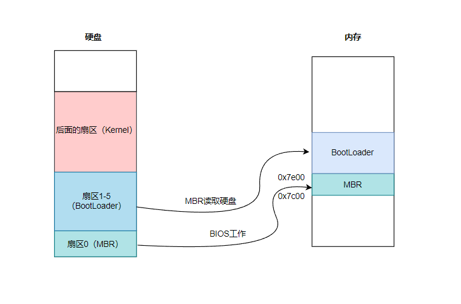
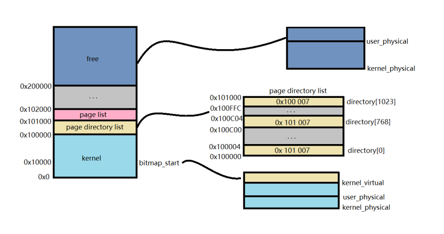

## 项目简介

本项目是一个**近两千行的操作系统**，运行环境为 `Linux`。基于 `qemu` + `gdb` 开发。原来系统为中山大学操作系统实验课（YatSen-OS），“麻雀虽小，五脏俱全”。本人基于此再做扩展功能。
目前已实现的机制包括：中断机制，进程和线程的实现，上下文切换，RR调度算法，虚拟二级分页机制。

## 运行过程概述

以下插图均为本人绘制，

### 开机过程

1. 电脑开机，**首先CPU指向BIOS**，BIOS是个无情的代码搬运工，将启动区（硬盘中的第一扇区,512byte）搬运到了内存0x7c00，同时跳转到MBR开始执行。
2. **执行MBR内容**：MBR代码内容设计为**将 bootloader 读写到起始地址**（这里设计成0x7e00） ，随后跳转到 bootloader 继续执行。
3. **bootloader内容**：这里设计为**进入保护模式**的逻辑，即写GDT及GDTR寄存器，段选择子，同时加载kernel到内存并跳转到kernel运行
4. **跳转到 kernel 运行**

###  虚拟与实际地址映射

## 扩展功能

- [ ] malloc/free 的实现
- [ ] 文件系统的实现
- [ ] Shell 的实现
- [ ] CopyOnWrite

